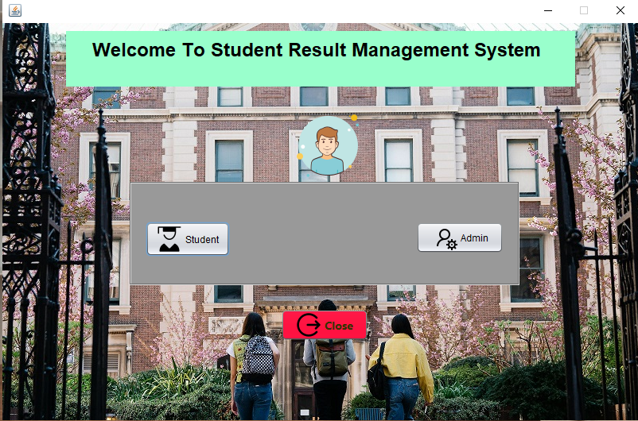

# Student Result Management System

This project aims to develop a Student Result Management System using Java, Java Swing, JFrame, and MySQL database. It provides functionalities for both administrators and students to manage and view academic results.

## Technologies Used
- **Java**: Core programming language for implementing project logic, including object-oriented programming concepts.
- **Java Swing**: Part of Java Foundation Classes (JFC), used for creating lightweight GUI applications.
- **JFrame**: Provides the main window for arranging and coding UI components.
- **MySQL**: Database system utilized for storing and accessing data.
- **JDBC (Java Database Connectivity)**: Facilitates interactions between Java applications and MySQL databases.

## Project Setup

### Prerequisites
- [Netbeans IDE](https://netbeans.apache.org/download/index.html) (Recommended for ease of development)
- MySQL Database ([MySQL Workbench](https://dev.mysql.com/downloads/windows/installer/8.0.html))

### Steps to Set Up Project
1. Open Netbeans IDE and create a new project.
2. Choose "Java with Ant" as the project type.
3. Name the project "Student Result Management Portal." Name can be Modified as per our need.
4. Add necessary dependencies through Ant.
5. Design GUI using Java Swing components within JFrame.
6. Configure database connection using JDBC for MySQL operations.
7. Ensure all components are properly styled and functional.

## Project Structure

The project is divided into several sections, each focusing on specific functionalities:

### Admin Section
- **Home Page**: Entry point for administrators.
- **Login Page**: Authentication interface with username and password fields.
- **Add New Student Page**: Interface for adding/registering new student to the database.
- **Add Result Page**: Interface for adding students result which is already registered inside the database.
- **View Registered Students and Results**: Displays registered students and their corresponding results in a table format.

### Student Section
- **Roll Number Search**: Allows students to search for their academic results using their roll numbers.

### Features Added
- **Show Password Functionality**.
- **Admin Login From Database**.
- **Display Grades and Status of Students when showing the Result**.
- **Some UI Functionality**.

## Running the Project

1. Clone the repository to your local machine.
2. Open the project in Netbeans IDE.
3. Ensure MySQL is running and the necessary database is set up.
4. Build and run the project from within the IDE.
5. Navigate through the various sections using the provided interfaces.

## Screenshots
 

## Contributors

- [Mohammad Asif Lone](https://github.com/loneasif88)

## License

This project is licensed under free License.

---

